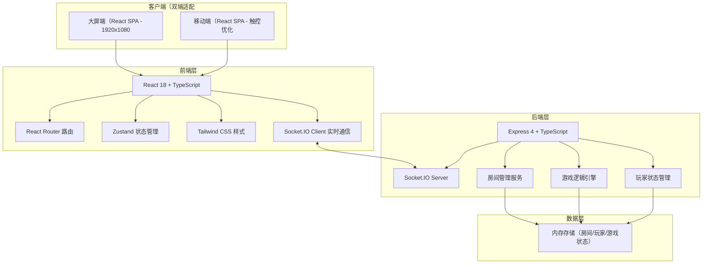
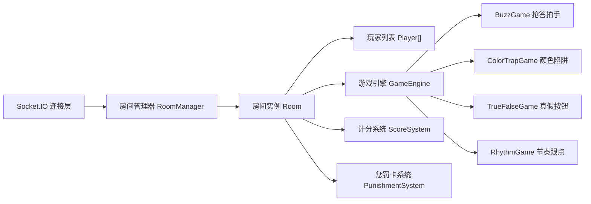
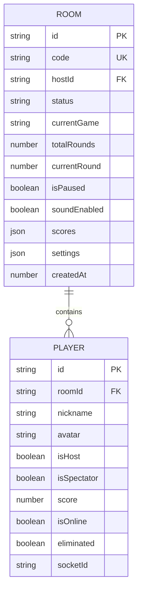

## 1. 架构设计



## 2. 技术栈说明

- **前端**：React@18 + TypeScript + React Router DOM@6 + Tailwind CSS@3 + Zustand@4 + Vite@5
- **后端**：Express@4 + TypeScript + Socket.IO@4
- **实时通信**：Socket.IO（WebSocket + HTTP 长轮询回退）
- **构建工具**：Vite@5（前端）+ ts-node（后端开发）
- **UI组件库**：自定义组件 + Lucide React 图标
- **音频**：Web Audio API 音效播放
- **二维码**：qrcode.react 二维码生成
- **海报生成**：html2canvas 截图生成海报
- **动画**：Framer Motion 动画库

## 3. 路由定义

| 路由 | 用途 | 适用端 |
|------|------|--------|
| / | 大厅页面（创建/加入房间） | 大屏+移动端 |
| /room/:roomId | 房间等待页面 | 大屏+移动端 |
| /game-select/:roomId | 游戏选择页面 | 大屏端 |
| /game/:roomId | 游戏进行页面 | 大屏+移动端 |
| /result/:roomId | 结算页面 | 大屏+移动端 |
| /players/:roomId | 玩家管理页面 | 主持人端 |
| /settings/:roomId | 设置页面 | 主持人端 |
| /share/:roomId | 战绩分享页面 | 全端 |

## 4. API 与 Socket 事件定义

### 4.1 Socket.IO 事件

| 事件名 | 方向 | 数据格式 | 用途 |
|---------|------|---------|------|
| createRoom | C→S | { nickname, avatar } | 创建房间 |
| roomCreated | S→C | { roomId, hostId, code } | 房间创建成功 |
| joinRoom | C→S | { roomCode, nickname, avatar, isSpectator } | 加入房间 |
| playerJoined | S→C | { players, player } | 新玩家加入通知 |
| playerLeft | S→C | { players, leftPlayerId } | 玩家离开 |
| updatePlayer | C→S | { nickname?, avatar? } | 更新玩家信息 |
| playerUpdated | S→C | { player } | 玩家信息更新 |
| kickPlayer | C→S | { playerId } | 踢出玩家 |
| playerKicked | S→C | { playerId } | 玩家被踢出 |
| transferHost | C→S | { newHostId } | 转让主持人 |
| hostTransferred | S→C | { hostId } | 主持人变更 |
| selectGame | C→S | { gameType, rounds, mode } | 选择游戏和设置 |
| gameSelected | S→C | { gameConfig } | 游戏配置同步 |
| startGame | C→S | {} | 开始游戏 |
| gameStarted | S→C | { gameState } | 游戏开始通知 |
| gameAction | C→S | { action, payload } | 玩家游戏操作 |
| gameStateUpdate | S→C | { gameState } | 游戏状态同步 |
| roundEnd | S→C | { roundResult } | 单回合结束 |
| gameEnd | S→C | { finalResult } | 游戏结束 |
| pauseGame | C→S | {} | 暂停游戏 |
| gamePaused | S→C | {} | 游戏暂停 |
| resumeGame | C→S | {} | 继续游戏 |
| gameResumed | S→C | {} | 游戏继续 |
| drawPunishment | C→S | {} | 抽取惩罚卡 |
| punishmentDrawn | S→C | { card, playerId } | 惩罚卡结果 |
| reconnect | C→S | { roomId, playerId, token } | 断线重连 |
| reconnected | S→C | { roomState, playerState } | 重连成功状态同步 |
| error | S→C | { code, message } | 错误通知 |

### 4.2 TypeScript 类型定义

```typescript
// 玩家
interface Player {
  id: string;
  nickname: string;
  avatar: string;
  isHost: boolean;
  isSpectator: boolean;
  score: number;
  isOnline: boolean;
  eliminated: boolean;
  connected: boolean;
}

// 房间
interface Room {
  id: string;
  code: string;
  hostId: string;
  players: Player[];
  status: 'waiting' | 'playing' | 'result';
  currentGame: GameType | null;
  gameConfig: GameConfig | null;
  gameState: GameState | null;
  totalRounds: number;
  currentRound: number;
  scores: Record<string, number>;
  isPaused: boolean;
  soundEnabled: boolean;
  settings: RoomSettings;
  createdAt: number;
}

// 游戏类型
type GameType = 'buzz' | 'colorTrap' | 'trueFalse' | 'rhythm';

// 游戏配置
interface GameConfig {
  type: GameType;
  rounds: number;
  mode: 'score' | 'elimination';
  roundTime: number;
}

// 游戏状态
interface GameState {
  phase: 'countdown' | 'playing' | 'ended';
  round: number;
  question?: any;
  answers?: Record<string, any>;
  startTime: number;
  endTime: number;
}
```

## 5. 服务端架构



## 6. 数据模型

### 6.1 数据模型定义（内存存储）



### 6.2 内存结构

- **房间存储**: `Map<string, Room>` — 按房间ID索引
- **房间码索引**: `Map<string, string>` — 房间码 → 房间ID映射
- **玩家索引**: `Map<string, string>` — 玩家ID → 房间ID映射（用于断线重连）
- **Socket映射**: `Map<string, string>` — SocketID → 玩家ID映射
